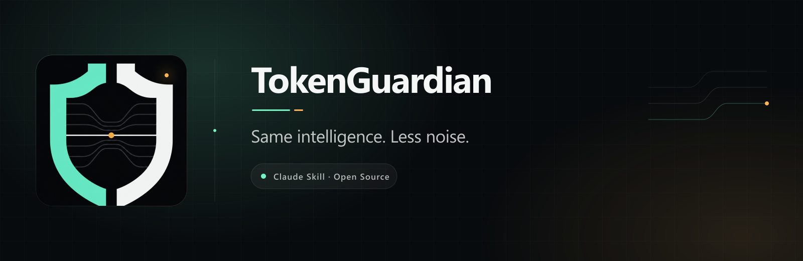
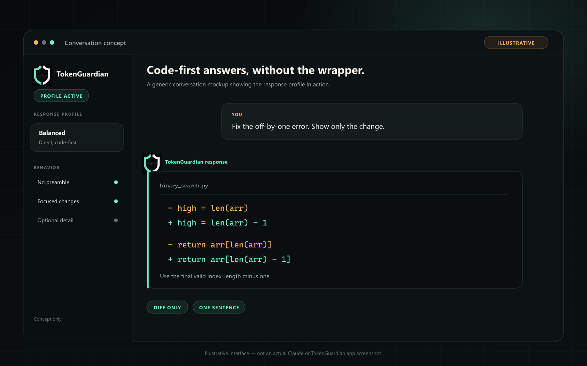
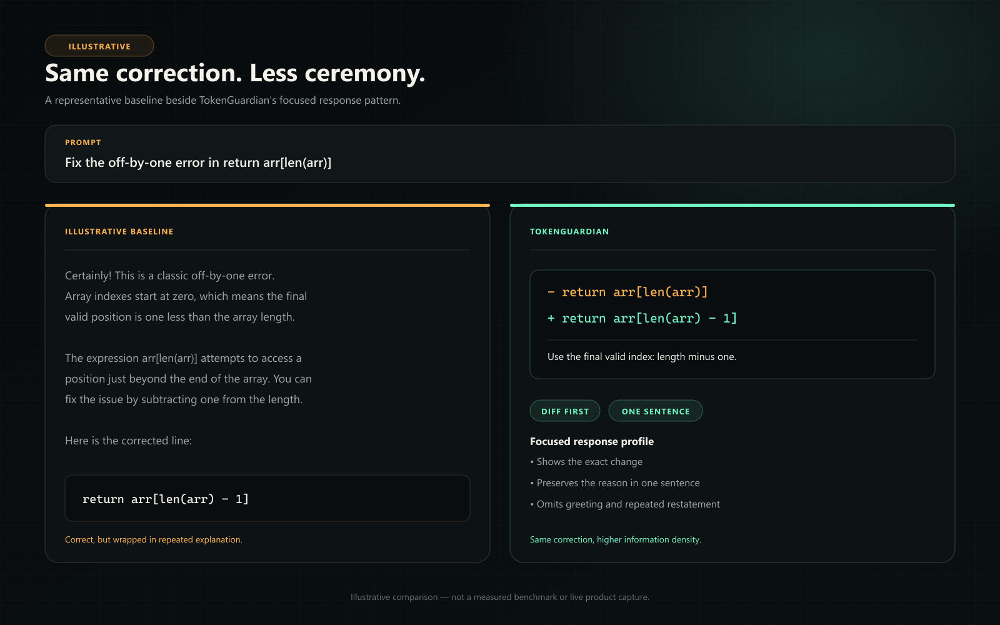
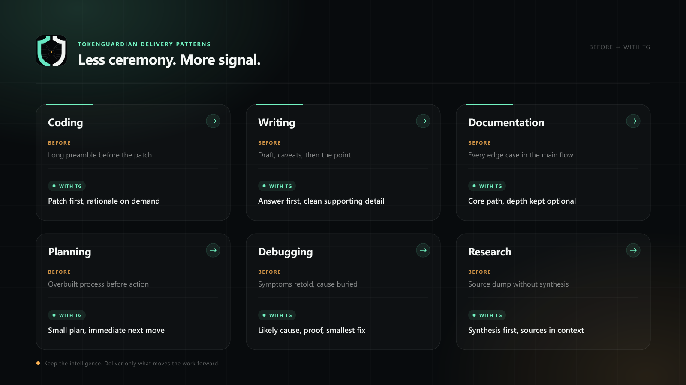
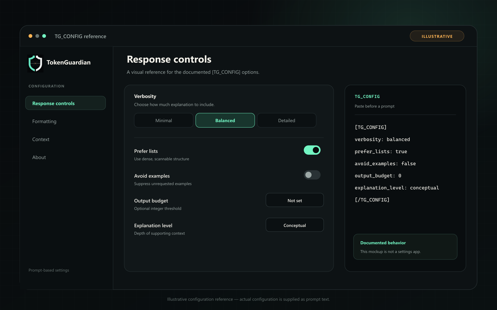
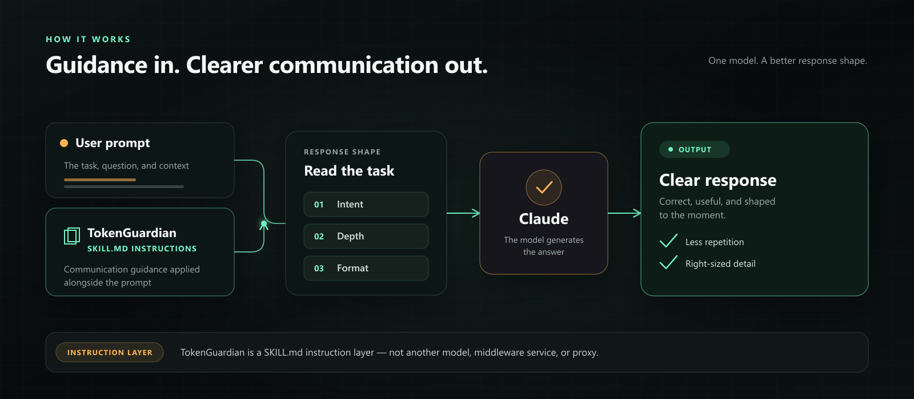
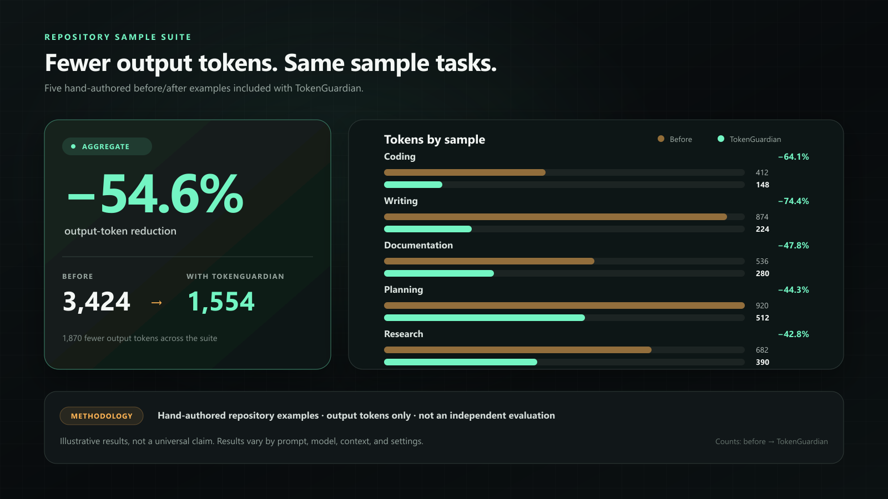

<p align="center">
  
</p>

<p align="center">
  <a href="./LICENSE"></a>
  <a href="./SKILL.md"></a>
  <a href="./SKILL.md"></a>
</p>

<p align="center">
  <strong>TokenGuardian is a Claude Skill that makes answers shorter where they can be—and complete where they must be.</strong>
</p>

<p align="center">
  Less preamble. Less repetition. Better structure. Detail when the task needs it.<br>
  It changes response instructions—not the model underneath.
</p>

<p align="center">
  <a href="#compare">Compare</a> ·
  <a href="#install">Install</a> ·
  <a href="#features">Features</a> ·
  <a href="#configure">Configure</a> ·
  <a href="#benchmarks">Evidence</a> ·
  <a href="#roadmap">Roadmap</a> ·
  <a href="#faq">FAQ</a>
</p>

<br>

<p align="center">
  
</p>

<a id="compare"></a>

## Ask for the answer. Get the answer.

TokenGuardian changes the delivery, not the task. It removes avoidable ceremony, chooses formats that scan quickly, and preserves necessary context when brevity would hurt the result.

<p align="center">
  
</p>

> [!NOTE]
> The comparison is illustrative. Model behavior varies with the prompt, model version, settings, and conversation context.

<a id="install"></a>

## Install

### Claude

1. [Download `tokenguardian.zip`](./dist/tokenguardian.zip).
2. Open **Customize → Skills → + → Create skill → Upload a skill**.
3. Upload the ZIP and enable TokenGuardian.

[Claude custom-skill guide →](https://support.claude.com/en/articles/12512180-use-skills-in-claude)

### Claude Code

Install it for every project:

```bash
mkdir -p ~/.claude/skills/tokenguardian
cp SKILL.md ~/.claude/skills/tokenguardian/SKILL.md
```

Then invoke `/tokenguardian`, or let Claude load it when the task matches. For one repository only, place the file at `.claude/skills/tokenguardian/SKILL.md`.

[Claude Code skill locations →](https://code.claude.com/docs/en/slash-commands#where-skills-live)

<a id="features"></a>

## One skill. Many kinds of work.

| | |
| --- | --- |
| **↕ Adaptive depth**<br>A command can be one line. An architecture review cannot. TokenGuardian scales detail to the task. | **◫ Progressive disclosure**<br>The direct answer comes first. Examples, caveats, and deeper explanation appear when useful or requested. |
| **≠ Less duplication**<br>Edits become diffs. Rewrites arrive as final copy. Comparisons become scannable tables. | **✓ Quality before brevity**<br>When concision conflicts with complete code, safety, or explicit requirements, completeness wins. |

<p align="center">
  
</p>

<a id="configure"></a>

## Your answer, your depth.

Prepend a `TG_CONFIG` block when you want per-prompt control:

```text
[TG_CONFIG]
verbosity: minimal
prefer_lists: true
[/TG_CONFIG]

Fix the failing test.
```

| Mode | Best for |
| --- | --- |
| `minimal` | Commands, direct edits, code-only output |
| `balanced` | Everyday work; concise context included |
| `detailed` | Reviews, explanations, and tradeoffs |
| `comprehensive` | Explicitly exhaustive requests |

<p align="center">
  
</p>

[See every option →](./docs/Configuration.md)

## How it works

TokenGuardian is an instruction layer inside `SKILL.md`. Your prompt and the skill rules guide Claude toward an intent, depth, and response format; Claude still does the underlying reasoning.

<p align="center">
  
</p>

## Real delivery patterns

| Task | Input | Without TokenGuardian | With TokenGuardian |
| --- | --- | --- | --- |
| Coding | “Write a CSV parser.” | Preamble, walkthrough, code, recap | Complete code first |
| Writing | “Tighten this paragraph.” | Revision plus editing commentary | Final copy |
| Planning | “Plan a zero-downtime deploy.” | Narrative sequence | Ordered checklist with gates |
| Research | “Compare Kafka and RabbitMQ.” | Stacked paragraphs | Decision-ready matrix |
| Documentation | “Document `POST /v1/users`.” | Repeated endpoint context | Compact schema reference |
| Debugging | “Fix this off-by-one error.” | Full-file reprint | Focused diff plus root cause |
| Summarization | “Summarize this incident.” | Prose recap | Impact, decisions, actions |
| Editing | “Remove repetition.” | Explanation of every change | Clean revision |
| Architecture | “Design a cache layer.” | Broad pattern survey | Recommended topology plus tradeoffs |

[Browse the paired examples →](./examples/)

<a id="benchmarks"></a>

## Evidence, with the caveat attached.

The repository includes five hand-authored baseline/TokenGuardian comparisons. Aggregating their listed output-token counts gives the snapshot below; it demonstrates the intended response strategies, not a guaranteed saving.

<p align="center">
  
</p>

> [!IMPORTANT]
> This is not an independent benchmark. A publishable result still needs a fixed model and version, identical parameters, raw outputs, repeated runs, and a quality rubric or executable tests.

[Run the comparison guide →](./tests/benchmark.md)

## Where TokenGuardian should step back

- Deliberately expressive or descriptive creative writing
- Legal, medical, safety-critical, or compliance text that must remain exhaustive
- Requests that explicitly ask for every step, caveat, or example
- Any case where shortening would remove required context or correctness

<a id="roadmap"></a>

## Roadmap

### Now

- [x] Claude Skill
- [x] Adaptive verbosity
- [x] Intent-aware response formats
- [x] Configuration blocks and paired examples

### Next

- [ ] Reproducible benchmark CLI
- [ ] Tool-use output minimization
- [ ] Dynamic token budgets
- [ ] MCP integration

### Exploring

- [ ] Model-specific variants
- [ ] Few-shot example compression

[See the full roadmap →](./ROADMAP.md)

<a id="faq"></a>

## FAQ

<details>
<summary><strong>Does TokenGuardian make Claude smarter?</strong></summary>
<br>
No. It changes response instructions, not the underlying model.
</details>

<details>
<summary><strong>Will every answer be shorter?</strong></summary>
<br>
No. TokenGuardian prioritizes correctness and explicit requirements. Some tasks need detail.
</details>

<details>
<summary><strong>Can I control the verbosity?</strong></summary>
<br>
Yes. Choose <code>minimal</code>, <code>balanced</code>, <code>detailed</code>, or <code>comprehensive</code> in a <code>TG_CONFIG</code> block.
</details>

<details>
<summary><strong>Will it reduce API cost?</strong></summary>
<br>
It can reduce output tokens for some prompts, but savings vary. TokenGuardian does not promise a fixed percentage.
</details>

<details>
<summary><strong>Does it support other models?</strong></summary>
<br>
TokenGuardian is designed for Claude. Other instruction-following models may apply parts of it, but they are not a tested support target here.
</details>

## Contributing

TokenGuardian is one Markdown file on purpose. Contributions that make it clearer, more reliable, or easier to evaluate are welcome.

[Contributing guide](./CONTRIBUTING.md) · [Code of conduct](./CODE_OF_CONDUCT.md) · [Security](./SECURITY.md) · [Support](./SUPPORT.md)

Released under the [MIT License](./LICENSE).

<br>

<p align="center">
  
</p>

<h3 align="center">Every token should earn its place.</h3>
