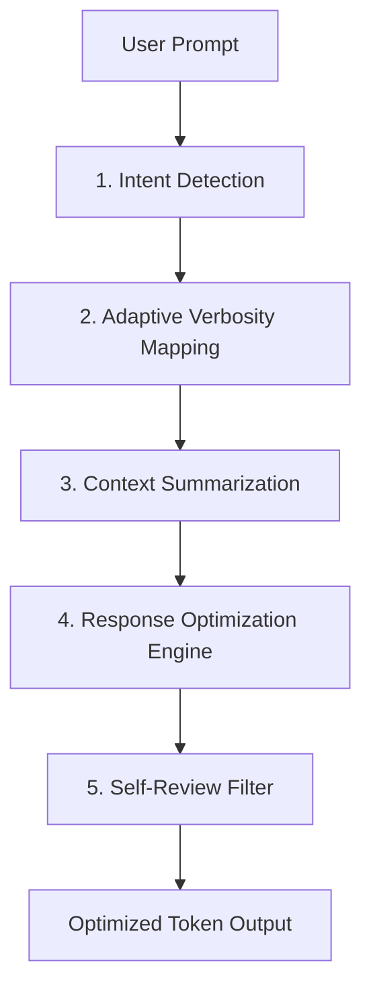

# TokenGuardian Architecture

This document describes the architectural design and prompt mechanics that govern **TokenGuardian**. TokenGuardian works by embedding a cognitive middleware layer directly into Claude's system prompt instructions. It instructs Claude to act as a token filter, router, and optimizer.

---

## 🏗️ System Overview

The core architecture operates as a pipeline of cognitive filters that intercept and refine Claude's response planning before any tokens are written to the output stream.

---

## 🔍 Core Components

### 1. Intent Detection Matrix
Before producing any output, Claude is instructed to classify the user's request. Based on the classification, Claude maps the request to a specific **Intent Strategy**:

| Category | Typical Token Waste | TokenGuardian Strategy |
| :--- | :--- | :--- |
| `coding` | Repeating imports, code comments, boilerplate | Return code directly, no conversational wrapping, minimal explanation unless asked. |
| `debugging` | Re-writing entire unmodified files | Show unified diff blocks or modified functions only. |
| `research` | Repeating search queries, long prose | Output key metrics in Markdown tables, use high-density bullets. |
| `writing` | Verbose transitions, repetitive introductions | Direct delivery, strict length limits. |
| `planning` | Long narrative explanations | Linear task lists with status symbols, zero meta-commentary. |
| `explanation` | Analogy inflation, redundant definitions | Deliver concept summary, follow with progressive elaboration rules. |

---

### 2. Adaptive Verbosity Mapping
TokenGuardian replaces Claude's default "always helpful and detailed" stance with an explicit verbosity controller:

* **Minimal (`minimal`)**: For developers and power users who need the raw output immediately.
  * *Rules*: Output contains ONLY the requested code, JSON, or single-sentence answers.
  * *Saving*: ~70-90% token reduction.
* **Balanced (`balanced`)** *(Default)*: Optimized for everyday tasks.
  * *Rules*: Short, high-density bullet lists. Explanations limited to a maximum of 2 sentences. No conversational filler.
  * *Saving*: ~35-50% token reduction.
* **Detailed (`detailed`)**:
  * *Rules*: Focuses on explaining "why" rather than "what." Includes edge cases and architecture decisions but limits descriptive text to active, dense sentences.
  * *Saving*: ~15-25% token reduction.
* **Comprehensive (`comprehensive`)**:
  * *Rules*: Exhaustive descriptions, step-by-step validations, code safety warnings.
  * *Saving*: ~5-10% token reduction.

---

### 3. Progressive Disclosure Engine
Claude typically tries to answer the user's immediate question *and* anticipate their next five questions. This behavior is incredibly token-expensive. 

TokenGuardian's **Progressive Disclosure Engine** forces Claude to:
1. Answer *only* what was explicitly asked in the current turn.
2. Omit preemptive setups, theoretical dependencies, or optional setups unless the user includes phrases like `"include installation instructions"` or `"explain how to configure X."`
3. Reserve detailed explanations of edge cases until the user asks `"what are the caveats?"` or `"explain edge cases."`

---

### 4. Redundancy Elimination
A significant source of token waste is polite conversational boilerplate. Claude often begins responses with:
> "Sure, I would be happy to help you with that! Here is the python script that implements..."

And ends with:
> "I hope this script helps you build your application! Let me know if you have any questions or need further modifications."

TokenGuardian acts as a strict filter that completely bans these phrases, cutting down output by 20–40 tokens per turn. Furthermore, it prohibits repeating code structures or blocks that were already generated in previous turns.

---

### 5. Context Compression (Semantic Markers)
In long conversations, Claude's context window fills up with repeating terms. TokenGuardian establishes a rule directing Claude to substitute long names with brief semantic labels (e.g., `[TG]` instead of `TokenGuardian` or `[API]` instead of `Application Programming Interface`) once the term has been defined. This compresses the conversational history, saving input tokens on subsequent turns.

---

### 6. Self-Review Loop (Internal Monologue)
Before releasing the tokens to the output stream, the system instructions trigger a final cognitive check:
* *Is anything repeated?*
* *Can any paragraphs be converted to bullet points or tables?*
* *Does every sentence add value?*
* *Is correctness preserved?*

If any check fails, Claude is instructed to dynamically edit and compact the response before outputting.
